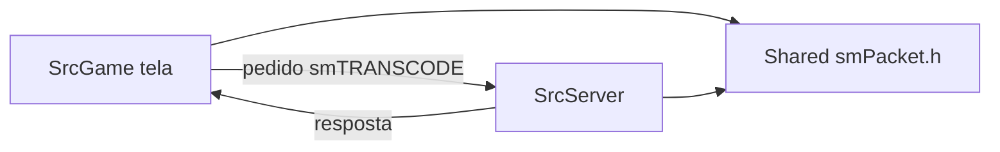

# Mapa Geral do Projeto — entender a estrutura em uma leitura

> Este é o ponto de partida didático **antes** de mergulhar na arquitetura
> técnica detalhada (`02-Arquitetura/Arquitetura.md`). Ele te dá o "mapa
> mental" geral em linguagem simples, com exemplos reais de código.
>
> **Como usar:** leia esta nota como primeiro contato com o projeto. Na
> dúvida sobre "onde fica X no código", volte aqui — ele te aponta a pasta.

---

## A ideia central: dois programas que conversam

Pense num restaurante com **cozinha** e **salão**:

- **Salão = Cliente (`SrcGame`)** — o que você vê: desenha o jogo na tela,
  lê seus comandos (teclado/mouse) e manda pro servidor.
- **Cozinha = Servidor (`SrcServer`)** — a autoridade: sabe tudo do mundo,
  decide o que acontece, guarda os personagens no banco de dados.
- **Balcão de pedidos = `Shared/smPacket.h`** — o "dicionário" que garante
  que o pedido do salão significa a mesma coisa na cozinha.

O salão **nunca decide sozinho** — ele manda o pedido, a cozinha decide e
responde. Isso é a arquitetura **cliente-servidor**.

No disco, sao **tres pastas** (nao misturar): cliente do jogo
`C:\Cliente Full`, codigo `C:\Source Priston\Source Priston`, este livro
`C:\Users\carol\Desktop\doc-projeto`. Detalhe: [[Tres-Diretorios]].



---

## As 4 pastas de cima

```
Source Priston/
├── SrcGame/      <- CLIENTE: o jogo que desenha na tela
├── SrcServer/    <- SERVIDOR: autoridade do mundo + banco de dados
├── Shared/       <- o "dicionário" idêntico dos dois lados
└── dependencies/ <- bibliotecas prontas de terceiros (NÃO MEXER)
```

---

## 1) `Shared/` — entenda primeiro (é o mais importante)

Tudo que cliente e servidor têm em comum mora aqui. É por isso que mudar
`Shared/` **sem revisar os dois lados** quebra o jogo silenciosamente.

| Arquivo/Pasta | O que é | Analogia |
|---|---|---|
| `smPacket.h` | **O dicionário de rede** — os códigos `smTRANSCODE_*` | O cardápio padronizado de pedidos |
| `LevelTable.h` | Tabela de XP por nível | A tabela de preço do leveling |
| `GlobalsShared.h` | Constantes globais (limites de ouro etc.) | Regras gerais impressas na parede |
| `Skills/` | Cabeçalhos das skills das 9 classes | As fichas das magias |
| `Utils/` | Utilidades comuns (matemática 3D, logs, mutex) | Ferramentas que os dois usam |
| `zlib/`, `rapidjson/`, `Discord/` | Bibliotecas prontas emprestadas | Ferramentas de terceiros |

**Exemplo real — o dicionário (`Shared/smPacket.h`):**
```cpp
#define smTRANSCODE_CONNECTED    0x48470080  // "conectei"
#define smTRANSCODE_VERSION      0x4847008A  // "qual versão?"
#define smTRANSCODE_ATTACKDATA   0x48470030  // "mandei dano num alvo"
```

Quem **envia** o pacote usa o nome; quem **recebe** tem um `switch` grande
com esses nomes pra decidir o que fazer. **Alterar um número = quebrar a
conversa.** Por isso nunca se inventa um código novo sem pesquisar antes.

---

## 2) `SrcServer/` — o servidor (a "cozinha")

Estrutura real (confirmada): `Character/`, `GameServer/`, `Database/`,
`Login/`, `Chat/`, `Party/`, `Quest/`, `Shop/`, `GM/`, `Skills/`, `Eventos/`,
`VIP/`, `Caravana/`, `Roleta/`, `Aging/`, `Security/`, `Ranking/`,
`sinbaram/`, `smLib3d/`, `English/` (textos), `Data/` (salvamento `.dat`),
e o núcleo em `SrcServer/SrcServer/OnSever.cpp`.

| Pasta/arquivo | Função real | Analogia |
|---|---|---|
| `SrcServer/SrcServer/OnSever.cpp` | **O coração** — ~34 mil linhas: entrada, game loop, dispatch de pacotes | O chefe de cozinha |
| `Winmain.cpp` -> `ServerWinMain()` | O ponto de partida que liga o servidor | Ligar o fogo |
| `Database/SQLConnection.cpp` | Camada moderna pra falar com o banco (12 bancos) | O livro de receitas (BD) |
| `GameServer/GameServer.cpp` | Carrega monstros, itens, NPCs e drops do banco | Buscar ingredientes no estoque |
| `Character/` (`record.cpp` etc.) | Lógica do personagem + salvar no `.dat` | Cuidar do cadastro dos clientes |
| `smwsock.cpp` | A camada de rede (aceitar conexões) | O balcão de atendimento |
| `CLI/`, `GM/ServerCommand.cpp` | Console e comandos `/...` de administrador | O interfone do chef |

> Note: a pasta `Network/` existe mas está **vazia** — a rede do servidor
> vive em `smwsock.cpp`, não em `Network/`.

**Exemplo real — como o servidor começa (`OnSever.cpp`, `ServerWinMain`):**
```cpp
int ServerWinMain()
{
    LeIniStr("Database", "Host", "Server\\Config\\SQL.ini", szSQLHost);
    LeIniStr("Database", "User", "Server\\Config\\SQL.ini", szSQLUser);
    ...
    if (conseguiu ler) {
        SQL::GetInstance()->Connect(host, user, senha);  // conecta no banco
    } else {
        // fallback: senha fixa em texto puro (ponto de atenção de segurança)
        SQL::GetInstance()->Connect("PRIME\\DRACO", "sa", "DRACO123@#");
    }
}
```

**O que isso ensina:** o servidor guarda quase tudo num **banco de dados**
(SQL Server). Ele lê a configuração de arquivos `.ini` que ficam ao lado do
`.exe` (na pasta `Server\Config\` — **não estão no repositório**, são
criados na instalação).

---

## 3) `SrcGame/src/Game/` — o cliente (o "salão")

Estrutura real (confirmada): `Engine/` (DirectX/gráficos), `character.*`,
`playmain.*`/`playsub.*` (estados do personagem), `Game.*`, `Login/`,
`Chat/`, `Party/`, `Quest/`, `Shop/`, `Skill/`, `imGui/`, `HUD/`,
`Discord/`, `sinbaram/`, `VIP/`, `Caravana/`, `Eventos/`, `smLib3d/`,
`smwsock.*`, `Main.cpp`, `Winmain.cpp`, `game.ini`.

| Arquivo/pasta | Função | Analogia |
|---|---|---|
| `Winmain.cpp` / `Main.cpp` | Ponto de entrada do jogo | Abrir a porta do salão |
| `Engine/` (`DXGraphicEngine.cpp`) | Renderização 3D via Delta3D/DirectX | As luzes e decoração |
| `smwsock.*` | Rede no lado do cliente | O pedido que sai do salão |
| `character.cpp` | Classe `smCHAR` — todo personagem (o coração do cliente) | A ficha do personagem |
| `playmain.cpp` | Loop in-game + carregar mapas | O que seu personagem faz no mundo |
| `game.ini` | Config: pra qual servidor conectar | O endereço do restaurante |

> **Cuidado com nomes enganosos:** `Main.cpp`, `Game.cpp`, `CSystem.cpp`,
> `UnitGame.cpp` e `View.cpp` são **código morto** (sobras de tutorial) — o
> entry point real é `Winmain.cpp`.

---

## 4) `dependencies/` — não mexer

`Delta3D/` (engine 3D pré-compilada) e `ziparchive/` (leitura de `.pak/.zip`).
São bibliotecas prontas. **Nunca edite** — se der problema, contorne no
código do jogo.

---

## O fluxo que amarra tudo (o fio condutor)

1. Você abre o **cliente** (`SrcGame`) -> ele lê `game.ini` pra saber pra
   onde conectar (IP/porta).
2. Abre o **servidor** (`SrcServer`) -> ele lê `SQL.ini`, conecta no
   **banco**, carrega o mundo.
3. O cliente conecta no servidor pela rede — ambos usam os **mesmos códigos
   de `smPacket.h`** pra se comunicar.
4. Tudo que é "sério" (seu personagem, itens, XP) o **servidor decide e
   salva** — no banco e nos arquivos `.dat`.

**Esse é o fio condutor.** Qualquer pergunta sua ("onde está o sistema de
grupo?", "como funciona o login?") vira "qual pasta lida com isso?" — e é
isso que vamos estudando sistema por sistema, ligando cada um a este mapa.

---

## Onde continuar daqui

- Detalhe técnico verificado: `02-Arquitetura/Arquitetura.md` (a planta baixa)
- Protocolo de rede: `02-Arquitetura/Protocolo-de-Rede.md`
- Design completo (SDD): `05-Specs/SDD-Source-Priston.md`
- O que estudar em ordem: `03-Aprendizado-CPP/Trilha-de-Aprendizado.md`
- O que dá pra mexer: `08-Ideias/Backlog-de-Ideias.md`
- Como trabalhar: `07-Git-e-Workflow/Fluxo-de-Trabalho.md`
