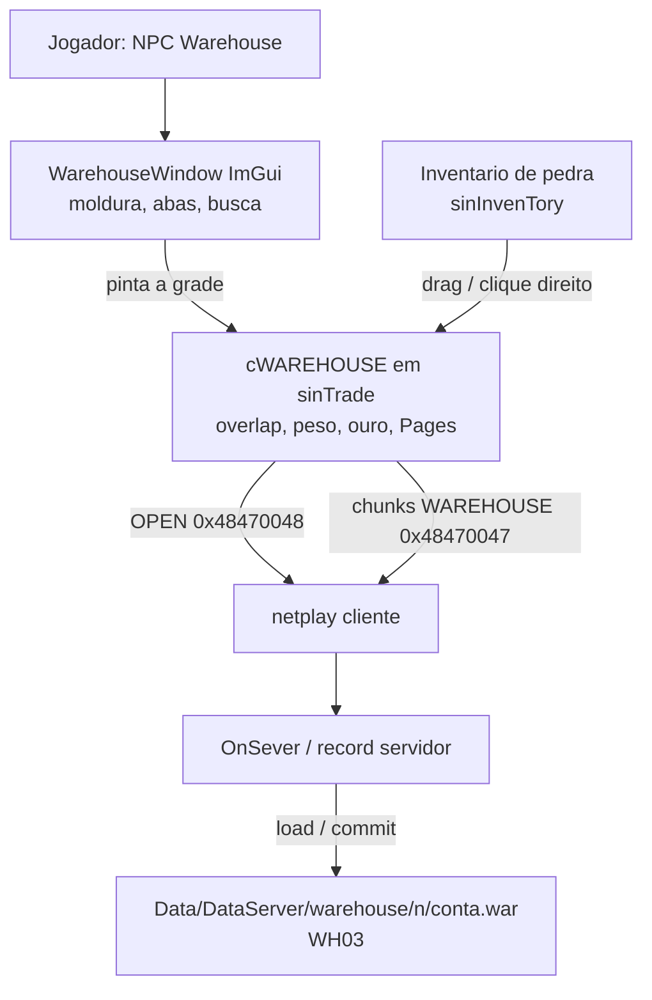

# Armazem: como funciona o processo inteiro

Documento auxiliar da planta [[Armazem]]. Aqui e o **como**, passo a
passo: quem pinta, quem decide, qual pacote, qual arquivo. Se a
proxima sessao for "o bau sumiu o item", comece pelos fluxogramas
abaixo e pela tabela de falhas
[[2026-09-18 - Armazem WH03 e falhas SQL]].

Uma frase: **ImGui so desenha; `cWAREHOUSE` arrasta; o servidor valida
e grava um `.war` WH03 no disco; o SQL do UserDB nao participa.**

## Camadas (nao misturar)



| Mundo | Classe / arquivo | Papel |
|---|---|---|
| Pintura | `WarehouseWindow` | Moldura 760×540, 3 abas, grade 20×15 escalada, busca, ouro |
| Logica | `cWAREHOUSE` | `sWAREHOUSE.Pages[5][300]`, overlap, peso `int`, backup de inventario |
| Fio | `Shared/WarehouseWire.h` + `smPacket.h` | Occupados comprimidos, chunks |
| Disco | `record.cpp` `WareHouseFileWrite` | Magica WH03, so itens ocupados |

Filtros PNG (armas, armaduras) sao **so UI**. Nao mudam o arquivo.

## Abrir o bau

```mermaid
sequenceDiagram
  participant P as Jogador
  participant C as Cliente
  participant S as Servidor
  participant D as Arquivo .war

  P->>C: Clique no NPC Warehouse
  C->>S: smTRANSCODE_OPEN_WAREHOUSE 0x48470048
  S->>D: GetWareHouseFile + WareHouseFileLoadItems
  alt Sem arquivo
    S->>S: Bau vazio, revision 1, ouro ofuscado 2023
  else Magica WH03
    S->>S: Le revision, money, weightMax, itens
  else Magica WH02 / legado
    S->>D: Copia .war.wh02
    S->>S: Importa 100 slots x ate 3 paginas
    S->>D: Regrava WH03
  end
  loop Cada pagina 0..2
    S->>C: smTRANSCODE_WAREHOUSE 0x48470047<br/>wVersion=3, dwTemp pagina/chunk/revision
  end
  Note over C: ApplyLoadedChunk; AllPagesReady nas 3 paginas
  C->>P: Janela ImGui + inventario de pedra
```

Detalhes do pacote de load:

- `dwTemp[0]` = pagina (0..2).
- `dwTemp[1]` / `[2]` = indice / total de chunks daquela pagina.
- `dwTemp[3]` = `Revision` lida do arquivo.
- `dwTemp[4]` = 1 no chunk final da ultima pagina (sessao pronta).
- `Data[]` = payload comprimido (`sWAREHOUSE_WIRE_HDR` + itens ocupados).
  Teto `WAREHOUSE_WIRE_DATA_MAX` 7800. Socket 8192.

Sessao no servidor: `OpenWarehouseInfoFlag`, `WareHouseItemInfo[1500]`,
mascara de chunks. Disconnect / reset chama `rsWareHouseSessionFree`.

## Usar (no cliente, sem pacote extra)

1. Drag inventario ↔ grade: `cWAREHOUSE` (mesmo codigo da pedra).
2. Clique direito na bag com o bau aberto: tenta depositar (peso,
   espaco, pocoes).
3. Busca por nome: filtro local nas 3 paginas ja carregadas.
4. Antes de mandar o save: `BackUpInvenItem2` guarda o inventario.
   Se o servidor recusar, `RestoreInvenItem` devolve os itens.

Nao ha transcode de "mover um slot". O fio so existe no **abrir** e
no **fechar**.

## Fechar / gravar

```mermaid
sequenceDiagram
  participant P as Jogador
  participant C as Cliente
  participant S as Servidor
  participant D as Arquivo .war

  P->>C: Fecha o bau
  C->>C: Backup do inventario
  loop Paginas 0..2
    C->>C: WareHouseCollectWire (so Flag=1)
    C->>S: Chunks 0x48470047 wVersion=3
  end
  Note over C,S: Ultimo chunk da pagina 2: dwTemp[4]=1 commit
  S->>S: Junta sessao; overlap; Head+ChkSum; inventario
  alt Valido
    S->>D: tmp + MoveFileEx WH03 (revision+1)
    S->>C: RESULT dwTemp[4]=2 ok=1
    C->>P: Janela fecha; item ficou no bau
  else Invalido ou disco falhou
    S->>C: RESULT ok=0 reason=...
    C->>C: RestoreInvenItem
    C->>P: Falha ao salvar o armazem.
  end
```

Commit no servidor (nome legado `WareHouseSqlCommit`): **nao fala com
SQL**. Escreve:

1. `DWORD` magica `0x33304857` (WH03)
2. `int` revision
3. `int` money
4. `int` weightMax
5. `int` unlocked (3)
6. `int` count
7. `sWAREHOUSE_SAVE_ITEM[count]` (Page, Slot, x,y,w,h, Class, `sITEMINFO`)

Gravacao atomica o bastante: `.war.tmp` depois `MoveFileEx` com
`REPLACE_EXISTING`.

Path: `Data\DataServer\warehouse\<GetUserCode(conta)>\<conta>.war`
relativo ao `server.exe`.

## Pacote de resultado

Mesmo transcode `0x48470047`, tamanho 48, `dwTemp[4] = WAREHOUSE_WIRE_RESULT` (2).

| Campo | Significado |
|---|---|
| `dwTemp[1]` | 1 = ok, 0 = falhou |
| `dwTemp[2]` | reason (`WAREHOUSE_RESULT_*`) |

| Reason | Nome | Uso tipico |
|---|---|---|
| 0 | `OK` | Gravou |
| 1 | `FAIL` | Generico / disco |
| 2 | `SQL` | Legado do experimento SQL; nao e o caminho vivo |
| 3 | `REVISION` | Legado SQL |
| 4 | `OVERLAP` | Grade 20×15 invalida |
| 5 | `DECODE` | Chunk corrompido |
| 6 | `VERSION` | `wVersion != 3` |

Client (`netplay.cpp`): log `Warehouse save result ok=%d reason=%d`.
`cWAREHOUSE::OnSaveResult` restaura inventario se `ok==0`.

## Anti-dupe (sem unique SQL)

1. Overlap 20×15 no servidor (`WareHouseValidatePageItems`).
2. Mesmo `Head+ChkSum` em dois slots da sessao → kick (`WareHouseKickCopy`).
3. Item ainda no `InvenItemInfo` no open: log, trata como deposito,
   sem kick (o item "viajou" da bag).
4. Pocoes / ouro (`WareHouseSkipUnique`) ficam de fora do unique.
5. Pagina >= `WAREHOUSE_UNLOCKED_PAGES` (3) recusada.

`Revision` ainda sobe a cada save (esta no arquivo). Nao ha compare-and-swap
contra outro processo SQL: **ultimo arquivo ganha**.

## O que nao mudou de proposito

- Transcodes `0x48470047` / `0x48470048`.
- Drag em `cWAREHOUSE`. Inventario ao lado em pedra.
- 3 abas jogaveis. Paginas 4–5 na RAM, sem aba.
- Compressao `EecodeCompress` / `DecodeCompress` no fio.
- Ofuscacao classica de ouro (valor 2023 no arquivo vazio) e peso
  (+196 no legado WH02). WH03 grava `money` e `weightMax` em claro
  no header do arquivo (o fio ainda usa o esquema antigo na pagina 0
  quando ecoa ouro).

## Arquivos (codigo)

| Lado | Arquivo |
|---|---|
| Shared | `smPacket.h`, `WarehouseWire.h` |
| Client | `HUD/WarehouseWindow.cpp`, `sinbaram/sinTrade.cpp`, `netplay.cpp` |
| Server | `Character/record.cpp`, `SrcServer/OnSever.cpp` |
| SQL (morto) | `docs/sql/Create-Warehouse.sql` — historico, nao usado |

Planta curta: [[Armazem]]. ADR [[0009 - Armazem arquivo WH03, SQL revertido]].
Protocolo: [[Protocolo-de-Rede]].
