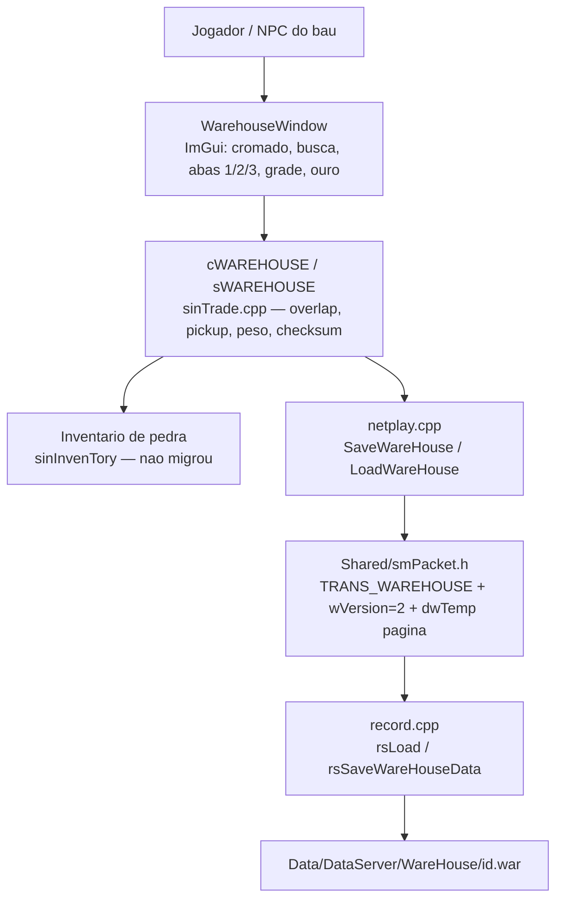
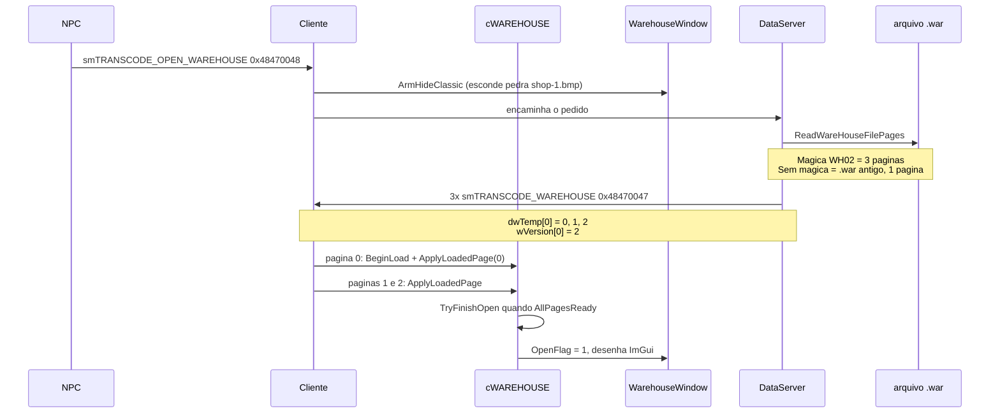
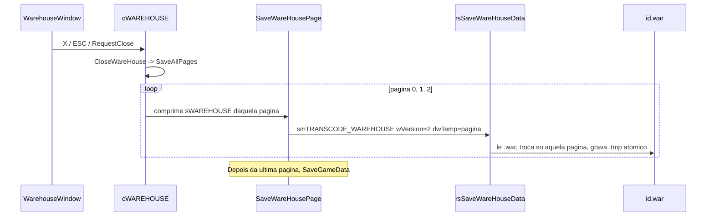
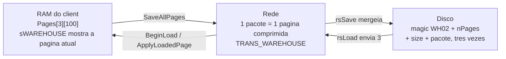
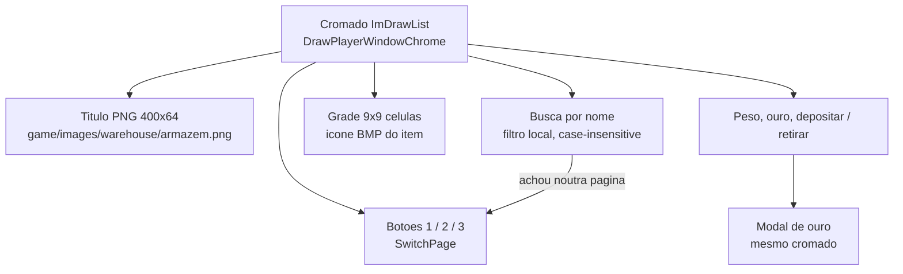

# Arquitetura — Armazem (3 paginas)

Como o baú funciona **depois** da remodelagem de 2026-09-15. Recap do
jogador: [[2026-09-15 - Recap Armazem ImGui paginas e busca]]. ADR:
[[0006 - Armazem ImGui, paginas no mesmo transcode]]. Spec original:
[[2026-09-13-armazem-paginas-busca]] (status `feita`; a UI saiu da
pedra — ver ADR 0006).

Convencao de fluxograma para outras features grandes:
[[Como-documentar-funcionalidade]].

## Em uma frase

A janela e ImGui (`WarehouseWindow`). A logica de item, peso, ouro e
checksum continua em `cWAREHOUSE`. Cada pagina de 100 slots viaja num
pacote `smTRANSCODE_WAREHOUSE` (`0x48470047`) ja existente. O arquivo
`.war` guarda as 3 paginas. Inventario permanece HUD de pedra.

## Camadas (quem faz o que)



Por que essa separacao: reescrever o drag 22 px em ImGui do zero duplica
item. O visual novo so pinta e traduz clique; quem mexe no `sITEM` e o
codigo legado que ja existia.

| Camada | Arquivo | Papel |
|---|---|---|
| Visual | `SrcGame/.../HUD/WarehouseWindow.cpp` | Cromado 15, busca, paginas, grade, modal de ouro, mouse |
| Logica | `SrcGame/.../sinbaram/sinTrade.cpp` (`cWAREHOUSE`) | 3 paginas na RAM, overlap, save, checksum |
| Rede client | `SrcGame/.../netplay.cpp` | Comprime 100 slots por pacote; `dwTemp[0]` = pagina |
| Contrato | `Shared/smPacket.h` | Mesmo transcode; constantes `WAREHOUSE_*`; `WareHouseItemInfo[300]` |
| Autoridade | `SrcServer/.../Character/record.cpp` | Le/grava `.war`; envia 3 pacotes; anti-dupe |
| Arte | `C:\Cliente Full\game\images\warehouse\armazem.png` | Titulo 400x64. Cromado nao e PNG |

Constantes (os dois lados, `smPacket.h`):

| Simbolo | Valor | Significado |
|---|---|---|
| `WAREHOUSE_PAGE_COUNT` | 3 | Paginas 0, 1, 2 (botoes 1 / 2 / 3 na UI) |
| `WAREHOUSE_PAGE_SLOTS` | 100 | Slots por pagina — igual ao legado |
| `WAREHOUSE_TOTAL_SLOTS` | 300 | Teto na RAM e em `WareHouseItemInfo` |
| `WAREHOUSE_PACKET_VERSION` | 2 | `wVersion[0]` do pacote novo |
| `WAREHOUSE_FILE_MAGIC` | `0x32304857` | Bytes `WH02` no inicio do `.war` |

Ouro e peso moram so na pagina 0. Paginas 1 e 2 zeram `WareHouseMoney` /
`UserMoney` no fio para nao duplicar gold.

## Abrir o bau



Se o pacote chegar sem versao 2 (cliente/servidor velho): a pagina 0
abre e `FillEmptyRemainingPages` zera 1 e 2. `.war` antigo nao corrompe.

Enquanto `IsLoadingPages()`, a pedra classica continua escondida
(`ShouldHideClassicPanels`). Sem isso o `shop-1.bmp` (compartilhado com
loja NPC / aging) aparece por um frame.

## Fechar e gravar



Nao cabe um blob de 300 `sITEM` no socket (`smSOCKBUFF_SIZE` = 8192).
Por isso **nao** inchamos `TRANS_WAREHOUSE.Data`. Cada pacote continua
com `Data[sizeof(sITEM)*100+256]`. Tres viagens, mesmo transcode.

O servidor **nao substitui o arquivo inteiro** com a primeira pagina:
lê as 3, aplica a que chegou, escreve de novo. Sem isso, mudar da
pagina 2 apagaria a 1.

## Memoria vs fio vs disco



Formato do `.war` novo:

```
DWORD magic     = 0x32304857   // "WH02"
int   nPages    = 3
para cada pagina:
    int  pktSize
    bytes do TRANS_WAREHOUSE (pktSize)
```

`.war` legado: um `TRANS_WAREHOUSE` cru, sem magica. O leitor
(`ReadWareHouseFilePages`) detecta, trata como 1 pagina, e o save
seguinte ja grava WH02 com paginas 2 e 3 vazias.

Checksum de item / ouro XOR (`dwChkSum`, `WareHouseMoney ^ chkSum`)
nao mudou de regra. Ouro so viaja na pagina 0.

Anti-dupe no servidor: `rsPLAYINFO.WareHouseItemInfo` passou de **120**
para **300** (`Shared/smPacket.h`). Loops em `OnSever.cpp` usam
`WAREHOUSE_TOTAL_SLOTS`, nao mais `100`.

## UI (o que o jogador clica)



- Busca **nao** apaga item: `ItemMatchesSearch` so esconde na grade.
  Se o nome esta noutra pagina, `FindSearchPage` troca sozinho.
- Clique na janela nao anda o personagem: `IsBlockingMouse` em
  `GameCore` / `Winmain` (mesmo padrao de Desafios).
- Campo de busca come teclado: `ShouldCaptureKeyboard` (senao o chat
  ou atalhos do `sinProc` roubam a letra).
- ImGui desenha **depois** do HUD de pedra (`sinDraw` em `sinMain.cpp`).
  Se renderizar antes (como estava em `sinCharStatus`), o BMP
  `CraftItemMain` cobre o bau.

Inventario ao lado continua pedra. Drag bau <-> bag usa as funcoes
antigas (`PickUpWareHouseItem`, `LastSetWareHouseItem`) com coordenada
logica convertida da grade ImGui.

## Pacotes (nenhum transcode novo)

| Codigo | Valor | Uso agora |
|---|---|---|
| `smTRANSCODE_OPEN_WAREHOUSE` | `0x48470048` | NPC pede para abrir. Client encaminha ao DataServer. |
| `smTRANSCODE_WAREHOUSE` | `0x48470047` | Ida e volta dos itens. `wVersion[0]=2`, `dwTemp[0]=pagina`. |

Caravana **nao** entrou neste desenho (`TRANS_CARAVAN` segue 100 slots).

## O que testar (arquitetura)

1. Personagem com `.war` antigo (100 slots) — abre, paginas 2 e 3 vazias, nao some ouro.
2. Depositar na pagina 2, fechar, relogar — item ainda na 2.
3. Busca com item na pagina 3 — a UI salta para essa pagina; limpar volta o filtro, nao apaga o item.
4. Inventario de pedra ao lado — drag nos dois sentidos.
5. Abrir mix/aging/loja NPC com o bau fechado — `shop-1.bmp` ainda aparece (compartilhado).
6. Peso acima do limite — `OPEN_WAREHOUSE` recusa como antes.

## Ver tambem

- Recap: [[2026-09-15 - Recap Armazem ImGui paginas e busca]]
- Sessao: [[2026-09-15 - Armazem ImGui paginas e save]]
- Protocolo geral: [[Protocolo-de-Rede]]
- Planta: [[Arquitetura]]
- Titulo PNG: [[Inventario-de-Artes]]
