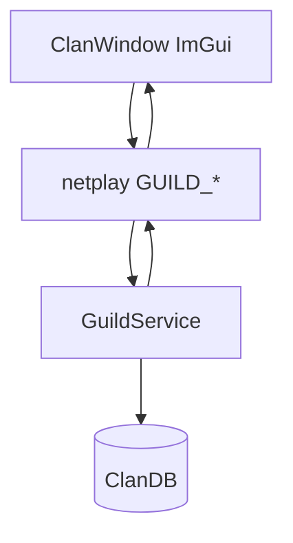
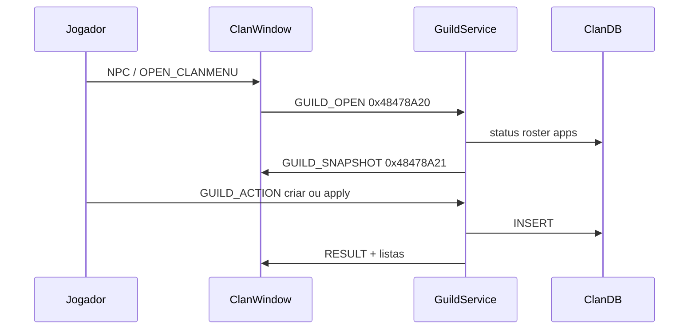

# Mestre dos Clan (guilda)

Planta viva. Recap: [[2026-09-19 - Recap Mestre dos Clan ImGui]].
Spec: [[2026-09-19-mestre-dos-clan]].
ADR: [[0010 - Mestre dos Clan ImGui, GuildWire e ClanDB]].
Kit agente: source `ANTIGRAVITY AGENT/FLOWS/clan.md`.

## Uma frase

ImGui kit B pinta a janela; `GuildService` decide; o estado mora em
`ClanDB` (`CL` / `UL` + Profile / Application / Audit).

## Camadas

## Fluxo feliz

## Fio (`Shared/GuildWire.h` + `smPacket.h`)

| Simbolo | Valor | Direcao |
|---|---|---|
| `smTRANSCODE_OPEN_CLANMENU` | `0x48478A00` | S->C abre janela (legado) |
| `smTRANSCODE_GUILD_OPEN` | `0x48478A20` | C->S pede snapshot |
| `smTRANSCODE_GUILD_SNAPSHOT` | `0x48478A21` | S->C chunks |
| `smTRANSCODE_GUILD_SEARCH` | `0x48478A22` | C->S busca |
| `smTRANSCODE_GUILD_ACTION` | `0x48478A23` | C->S comando |

SQL: `docs/sql/Create-ClanGuild.sql`. C++ nao cria tabela no boot.

## O que nao mudou

Menu TJBOY / HTTP de cla legado continua no disco; a janela nova nao
passa por ele. Guerra de castelo e marca 3D fora desta planta.

## Pendencia no codigo (19/09)

`GuildNpcOk` exige `rsPLAYINFO.dwGuildNpcTime`. Grep nao achou
assignment. Sem stamp, o server responde `GUILD_ERR_NPC`.
`SendOpenClanMenu` nao tem callers. Testar no jogo e corrigir o
stamp no talk do NPC.
