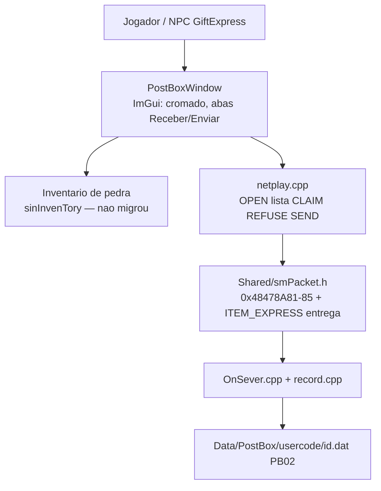
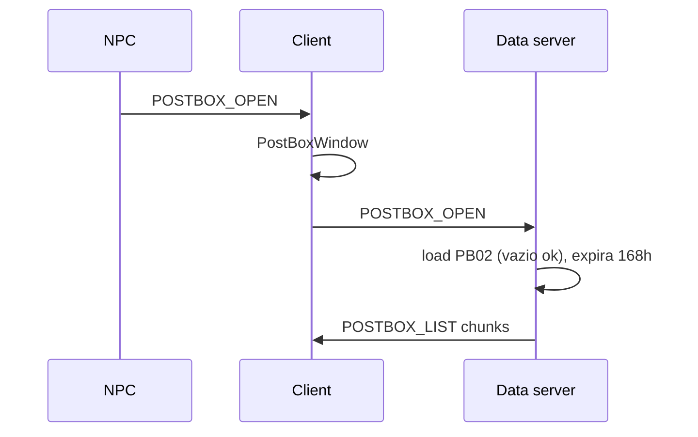

# Arquitetura — Distribuidor (correio)

Como o NPC distribuidor funciona **depois** da migracao ImGui de
2026-09-15. Recap: [[2026-09-15 - Recap Distribuidor ImGui e correio 168h]].
ADR visual: [[0005 - Distribuidor ImGui, armazem e inventario em pedra, artes no Cliente Full]].
ADR de protocolo/save: [[0007 - Distribuidor ImGui, PB02 e transcodes novos]].
Spec: [[2026-09-13-distribuidor-correio]] (`feita`).

Convencao de fluxograma: [[Como-documentar-funcionalidade]]. Molde: [[Armazem]].

## Em uma frase

A janela e ImGui (`PostBoxWindow`, lista + detalhe). A caixa continua
arquivo por conta. O servidor e a autoridade: tira o item, grava o
blob, entrega no claim. Inventario permanece HUD de pedra.

## Camadas

| Camada | Arquivo | Papel |
|---|---|---|
| Visual | `SrcGame/.../HUD/PostBoxWindow.cpp` | Cromado 15, lista, detalhe, envio |
| Rede client | `SrcGame/.../netplay.cpp` | Encaminha OPEN ao data server; recebe LIST/resultados |
| Contrato | `Shared/smPacket.h` | Transcodes novos; `_POST_BOX_ITEM` com remetente/data/blob |
| Autoridade | `SrcServer/.../OnSever.cpp` | Claim, recusa, send atomico |
| Save | `SrcServer/.../Character/record.cpp` | PB02, writer unico, TTL |
| Arte | `C:\Cliente Full\game\images\postbox\distribuidor.png` | Titulo 400x64 |
| Moldura (excecao) | `C:\Cliente Full\game\images\postbox\frame.png` | Janela 760x540, blit 1:1. Nao e o cromado 15 das outras telas. |

## Abrir

NPC no game server (`GiftExpress`) manda `POSTBOX_OPEN` no socket do
jogo, igual o bau. O cliente abre a janela e reenvia ao data server —
e la que mora o arquivo.

## Claim e envio

`ITEM_EXPRESS` (`0x48478A80`) so entrega **um** `sITEMINFO` depois do
claim. Abrir/listar/claimar/recusar/enviar usam `0x48478A81`–`0x48478A85`.

Claim casa pelo `dwEntryId`, nao pelo codigo do item. Inventario cheio:
o client nao manda CLAIM; o item fica na lista.

Envio: client manda nick + `sITEMINFO`. Servidor valida, tira do
inventario (ou potion count), grava blob no PostBox do destino
(online ou `UserInfo.Account` se offline). Sucesso devolve as chaves
para o client apagar o item local.

## Save PB02

Magica `0x32304250` (`PB02`). Arquivo texto antigo ainda abre. Load
**nao** apaga o `.dat`. Toda mutacao regrava na hora (temp + replace).
Quest, loja, GM e P2P passam por `rsAddPostBoxSystemItem` /
`rsAddPostBoxPlayerItem`.

Legado sem data = sem TTL. Itens novos ganham 168h
(`POSTBOX_TTL_SECONDS`). GM: `/postbox_ttl <segundos>`.

## Constantes

| Simbolo | Valor | Significado |
|---|---|---|
| `smTRANSCODE_POSTBOX_OPEN` | `0x48478A81` | C→S abrir / S→C NPC |
| `smTRANSCODE_POSTBOX_LIST` | `0x48478A82` | S→C chunks de metadados |
| `smTRANSCODE_POSTBOX_CLAIM` | `0x48478A83` | C→S id + senha |
| `smTRANSCODE_POSTBOX_REFUSE` | `0x48478A84` | C→S id |
| `smTRANSCODE_POSTBOX_SEND` | `0x48478A85` | C→S nick+item; S→C resultado |
| `POSTBOX_LIST_CHUNK` | 16 | Itens por pacote de lista |
| `POSTBOX_TTL_SECONDS` | 168*3600 | Prazo padrao |
| `POSTBOX_FILE_MAGIC` | `0x32304250` | Bytes `PB02` |
