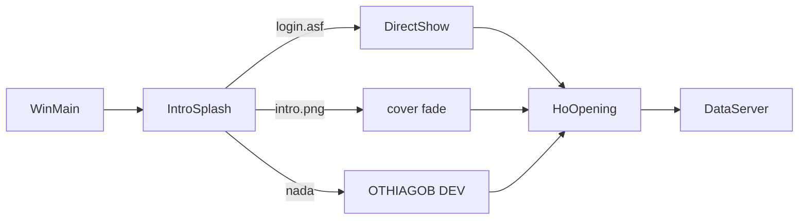
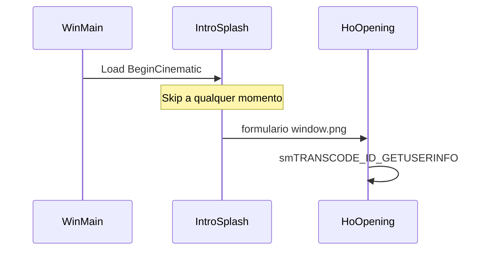

# Login e intro

Como o cliente chega ate o formulario de conta.

## Uma frase

Antes do login PNG Fallen Tale, `IntroSplash` tenta video DirectShow;
se faltar, PNG; se faltar, texto. Clique ou tecla pula. Sem pacote
de rede.

Arquivos: `SrcGame/.../Login/IntroSplash.*`,
`Engine/Directx/DXVideoRenderer.*`, `HoBaram/HoOpening.cpp`.
Brief: source `docs/prompt-antigravity-intro-ui.md`.
Runtime: `C:\Cliente Full`.

Char select continua TGA classico (`HoLogin`) — outra frente.
