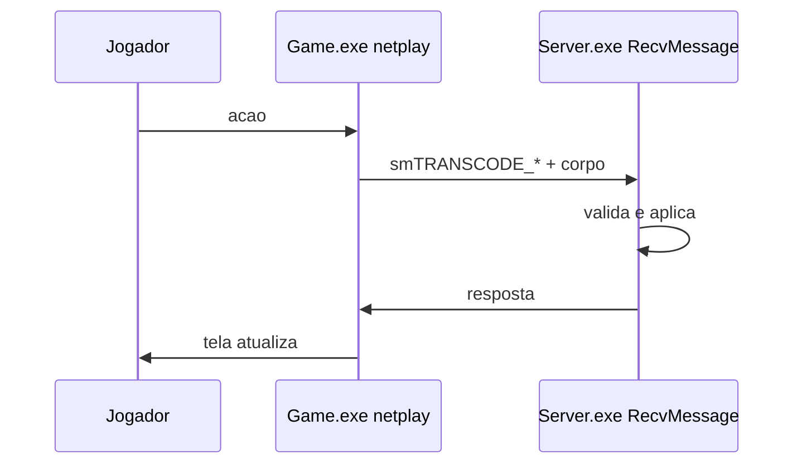

# Protocolo de Rede — como cliente e servidor conversam

> Verificado no código em 2026-08-31. Este é um dos documentos mais
> importantes do projeto: o protocolo é o "idioma" que o cliente e o
> servidor usam pra se entender. Mexer aqui sem cuidado quebra o jogo.

## Ideia geral

O cliente (Game.exe) e o servidor (Server.exe) trocam **pacotes** pela
rede. Um pacote é um monte de bytes com um **cabeçalho** (que tipo de
mensagem é) e um **corpo** (os dados). O código do pacote é o
`smTRANSCODE_*`.

## Onde está tudo

| Arquivo | Papel |
|---|---|
| `Shared/smPacket.h` | **O contrato.** ~2.800 linhas de códigos de pacote (`smTRANSCODE_*`) + structs de dados (ex: `smCHAR_INFO`, `TRANS_ATTACKDATA`, `rsPLAYINFO`). Compilado no cliente E no servidor. |
| `Shared/smwsock.h` | Socket/cliente de rede compartilhado. Define a porta do jogo: **`TCP_GAMEPORT 8185`** (idêntico nos dois lados). |
| `SrcServer/src/Server/smwsock.h` (e `SrcGame/src/Game/smwsock.h`) | Cópias do socket por lado (com o mesmo `TCP_GAMEPORT`). |
| `SrcGame/src/Game/netplay.cpp` | Rede do cliente — envio/recebimento e despacho de pacotes. |
| `SrcGame/src/Game/sinbaram/sinUtil.cpp` | Função `TransCommand` — o despachante de pacotes no cliente. |
| `SrcServer/.../Network/`, `GameServer/` | Recebimento e tratamento no servidor (detalhes na [[Arquitetura]]). |

## Códigos de pacote (smTRANSCODE_*)

Cada `#define` em `smPacket.h` é um número único que identifica um tipo de
mensagem. Exemplos reais:

| Código | Valor (parcial) | Significado |
|---|---|---|
| `smTRANSCODE_SYSTEM` | `0x48400000` | base de pacotes do sistema |
| `smTRANSCODE_CONNECTED` | `0x48470080` | conexão estabelecida |
| `smTRANSCODE_VERSION` | `0x4847008A` | checagem de versão |
| `smTRANSCODE_PLAYDATA1/2/3` | `0x48470010..12` | dados de personagem |
| `smTRANSCODE_ATTACKDATA` | `0x48470030` | ataque |
| `smTRANSCODE_ADDEXP` | `0x48470031` | ganho de XP |
| `smTRANSCODE_PLAYERINFO` | `0x48470020` | info do jogador |
| `smTRANSCODE_PUTITEM` / `DELITEM` | `0x48470052` / `0x48470051` | pegar/soltar item |
| `smTRANSCODE_SHOP_ITEMLIST` | `0x48470054` | lista de itens da loja |
| `smTRANSCODE_PARTY_*` | `0x484700A0..` | sistema de grupo |
| `smTRANSCODE_TRADE_*` | `0x48470041..` | sistema de troca |
| `smTRANSCODE_OPENLIVE` | `0x38000000` | modo "open live" |
| `smTRANSCODE_ENCODE_PACKET` / `_2` | `0x80010000` / `0x90010000` | pacote codificado/criptografado |

**Regra de ouro:** cada valor é único e tem UM significado. Nunca reutilize
um valor existente pra outra coisa — o cliente e o servidor vão interpretar
errado e o bug é silencioso.

## Structs de dados

Além dos códigos, `smPacket.h` define as **estruturas** que trafegam dentro
dos pacotes (linhas ~409 em diante). Exemplos:

- `smCHAR_INFO` — informações completas de um personagem (nome, classe,
 stats, equipamento...)
- `smCHAR_MONSTER_INFO` — idem para monstros
- `TRANS_ATTACKDATA` / `TRANS_ATTACKDATA2` — dados de um ataque
- `TRANS_SKIL_ATTACKDATA` — ataque com skill
- `rsPLAYINFO` — o jogador no servidor (classe gigante, linha ~1099)
- `Caravan` — estrutura do sistema de caravana
- `_POST_BOX_ITEM` — item de correio (post box)
- `QUEST_*` — estruturas de quest/missão

> Estas structs também precisam ser **idênticas** nos dois lados — por isso
> vivem em `Shared/`.

## Como um pacote flui (visão de pássaro)



```
Jogador aperta ataque no cliente
 -> cliente monta o pacote (código smTRANSCODE_ATTACKDATA + dados)
 -> envia pela rede (porta 8185)
 -> servidor recebe, valida (Security/), processa
 -> servidor responde (ex: dano causado, XP, estado do monstro)
 -> cliente recebe e atualiza a tela
```

Fluxo completo detalhado (arquivo por arquivo) é um ótimo exercício de
aprendizado — ver [[Trilha-de-Aprendizado]] Fase 2.

## Configuração de conexão

- **Porta do jogo:** `8185` (`TCP_GAMEPORT`, igual nos dois lados).
- **Cliente:** o `game.ini` (seção `[ConnectServer]`, chaves `IP`/`Port`)
 aponta pra onde conectar. O `smConfig.h` do cliente também guarda
 endereços de até 4 servidores diferentes (game, data, user, extend) —
 herança da arquitetura multi-servidor original do Priston.
- **Servidor:** escuta na porta de jogo. (Detalhes de bind/config na
 [[Arquitetura]] seção servidor.)

## Avisos de segurança

- Qualquer mudança de protocolo (novo pacote, struct alterada) exige
 **atualizar cliente E servidor juntos** — senão dessincroniza.
- O servidor deve **sempre validar** o que recebe (nunca confiar no
 cliente): dano, posição, itens. Validações vivem em `Security/` e nos
 handlers.
- `smTRANSCODE_ENCODE_PACKET*` sugere que existe camada de codificação de
 pacote — detalhes/uso exato: ver análise do servidor em [[Arquitetura]].

## Armazem (2026-09-18)

Nenhum transcode novo. Fluxogramas: [[Armazem]] · [[Armazem-como-funciona]].
ADR viva [[0009 - Armazem arquivo WH03, SQL revertido]]. ADR 0008
(SQL) esta substituida na persistencia.

| Codigo | Valor | Papel |
|---|---|---|
| `smTRANSCODE_OPEN_WAREHOUSE` | `0x48470048` | NPC pede para abrir; client encaminha ao DataServer |
| `smTRANSCODE_WAREHOUSE` | `0x48470047` | Itens. `wVersion[0]=3`. Tambem RESULT (`dwTemp[4]=2`) |

`dwTemp[0]` = pagina (0..2 no jogo; 3–4 recusados). `dwTemp[1/2]` =
indice/total de chunks. `dwTemp[3]` = `Revision`. `dwTemp[4]` = 1
commit no ultimo chunk do save; 2 = resultado ok/fail. `Data[]` =
ocupados comprimidos (`WAREHOUSE_WIRE_DATA_MAX` 7800), **nao** 300
`sITEM`. Socket 8192.

`WareHouseItemInfo` tem **1500** entradas. Ouro viaja no header do
`.war` WH03 e ecoa na pagina 0 do fio. Formato 2026-09-15 (`wVersion=2`,
100 `sITEM`, WH02) importa uma vez. SQL UserDB **nao** e o save vivo.

Caravana (`TRANS_CARAVAN`) nao entrou nesse desenho.

## Distribuidor / correio (2026-09-15)

Transcodes **novos**. `ITEM_EXPRESS` nao lista nem envia. Fluxogramas:
[[Distribuidor]]. ADR [[0007 - Distribuidor ImGui, PB02 e transcodes novos]].

| Codigo | Valor | Papel |
|---|---|---|
| `smTRANSCODE_ITEM_EXPRESS` | `0x48478A80` | S→C entrega de **um** `sITEMINFO` apos o claim |
| `smTRANSCODE_POSTBOX_OPEN` | `0x48478A81` | C→S abrir / S→C NPC GiftExpress |
| `smTRANSCODE_POSTBOX_LIST` | `0x48478A82` | S→C chunks de metadados (`POSTBOX_LIST_CHUNK` 16) |
| `smTRANSCODE_POSTBOX_CLAIM` | `0x48478A83` | C→S `dwEntryId` + senha |
| `smTRANSCODE_POSTBOX_REFUSE` | `0x48478A84` | C→S recusar |
| `smTRANSCODE_POSTBOX_SEND` | `0x48478A85` | C→S nick + item; S→C resultado |

Lista = metadados. O blob `sITEMINFO` viaja no save `PB02` e na entrega
(`ITEM_EXPRESS`). Socket 8192: nao mandar 500 itens cheios de uma vez.

## Mestre dos Clan (2026-09-19)

Transcodes **novos**. Fio em `Shared/GuildWire.h`. Planta: [[Clan]].
ADR [[0010 - Mestre dos Clan ImGui, GuildWire e ClanDB]].

| Codigo | Valor | Papel |
|---|---|---|
| `smTRANSCODE_OPEN_CLANMENU` | `0x48478A00` | S→C (legado) abre janela |
| `smTRANSCODE_GUILD_OPEN` | `0x48478A20` | C→S pede snapshot |
| `smTRANSCODE_GUILD_SNAPSHOT` | `0x48478A21` | S→C status/roster/search/apps/audit/result |
| `smTRANSCODE_GUILD_SEARCH` | `0x48478A22` | C→S query paginada |
| `smTRANSCODE_GUILD_ACTION` | `0x48478A23` | C→S apply/create/kick/... |

## Ver também

- [[Armazem]] · [[Armazem-como-funciona]] — planta e processo do bau
- [[Distribuidor]] — planta e mermaid do correio
- [[Clan]] — guilda
- [[Login-e-intro]] — intro sem transcode
- [[Glossario-Tecnico]] — termos do protocolo
- [[SDD-Source-Priston]] — documento de design completo
- [[Como-Rodar]] — porta 8185 na prática