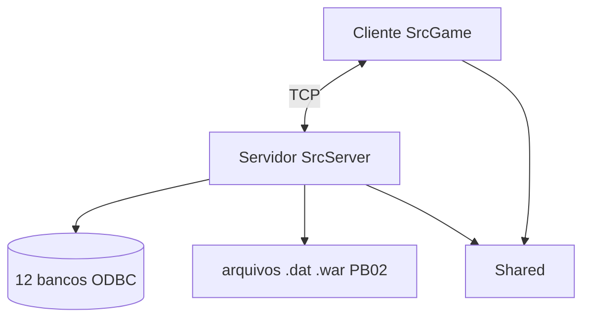

# SDD — Software Design Document · Source Priston

> **O que é este documento:** a "planta baixa oficial" do projeto. Ele
> consolida a arquitetura, o protocolo, o banco, o build e as convenções
> em UM lugar — para você e para as IAs (Cursor, Hermes) trabalharem com o
> mesmo entendimento. É um documento **vivo**: atualize sempre que o projeto
> mudar de verdade (não por mudança pequena de código — por mudança de
> estrutura/decisão).
>
> **Autor:** Thiago · **Base verificada:** 2026-08-31 (análise completa do código)

---

## 1. Identificação

| Campo          | Valor                                                                      |
| -------------- | -------------------------------------------------------------------------- |
| Projeto        | Source Priston (servidor privado de Priston Tale)                          |
| Base de código | WDPT (modernizada)                                                         |
| Linguagens     | C++ (cliente C++17, servidor C++14), Windows API, SQL                      |
| Ferramentas    | Visual Studio 2022 (v143), 32-bit (Win32)                                  |
| Cliente jogo   | `C:\Cliente Full`                                                          |
| Código-fonte   | `C:\Source Priston\Source Priston`                                         |
| Documentação   | `C:\Users\carol\Desktop\doc-projeto` (repo `othiagob/doc-projeto`)         |
| Git (codigo)   | `github.com/othiagob/Source-Priston` (branch `main`)                       |
| Estado         | Funcional — cliente e servidor compilam e o jogo loga                      |

## 2. Objetivos e escopo

**Objetivo do projeto:** manter e evoluir um servidor privado de Priston
Tale — corrigir bugs, adicionar sistemas, balancear o jogo — usando o
projeto como **material de estudo de C++ e engenharia de software** (com
ajuda de IA via Cursor e Hermes).

**Escopo:**
- [x] Servidor de jogo (autoridade, banco, segurança)
- [x] Cliente (renderização, UI, rede)
- [x] Protocolo compartilhado (Shared)
- [ ] Fora de escopo: engine gráfica (Delta3D é pré-compilada e não se edita),
 bibliotecas de terceiros (`dependencies/`, `API/`, `imGui/`, `srcsound/`)

## 3. Stack tecnológica

| Camada | Tecnologia |
|---|---|
| Linguagem | C++ (MSVC) — cliente C++17, servidor C++14 |
| Build | MSBuild/VCXPROJ (Visual Studio 2022, toolset v143, Win32) |
| Janelas | Win32 API (`WinMain`, mensagens, `WSAAsyncSelect`) |
| Gráficos | Direct3D 9 + engine Delta3D (pré-compilada) + smLib3d (legada) |
| UI | 3 sistemas: sin clássico (texturas), Engine/UI moderno, Dear ImGui |
| Rede | Winsock 1.1, TCP, pacotes com opcode `smTRANSCODE_*` |
| Banco | Microsoft SQL Server via ODBC (`{SQL Server}`) |
| JSON | rapidjson 1.1.0 (cliente) · nlohmann/json (servidor) |
| Scripts | Lua 5.0.2 (efeitos HoEffect no cliente) |
| Extras | Discord Rich Presence (cliente), libcurl/Chilkat (HTTP) |

## 4. Arquitetura de alto nível



```
+----------------------+                      +----------------------+
|       CLIENTE        |   TCP (pacotes       |       SERVIDOR        |
|  SrcGame\Game.exe    |   smTRANSCODE_*)     |  SrcServer\Server.exe |
|  C++17 - DirectX9    | -------------------> |  C++14 - console     |
|  render, input, HUD  | <------------------- |  autoridade, lógica   |
+----------------------+                      +----------+-----------+
                                                          |
                                     portas: 32299 (login) |
                                             8185 (jogo)   v
                                              +----------------------+
                                              |  SQL Server (ODBC)   |
                                              | 12 bancos: UserDB,   |
                                              | ServerDB, LogDB, ... |
                                              +----------------------+

Shared/ (compilado dentro dos dois): smPacket.h (protocolo),
LevelTable.h (XP), Skills/, Utils/, GlobalsShared.h
```

**Princípio central:** o cliente é "burro" e o servidor é a fonte da
verdade — todo estado importante é validado no servidor. Qualquer regra
que precise ser igual nos dois lados vive em `Shared/`.

## 5. Componentes

### 5.1 Cliente (`SrcGame/`) — resumo

- **Entry point:** `src/Game/Winmain.cpp` (janela + game loop + render + input)
- **Render:** Direct3D9 via `Engine/Directx` (novo) + `smLib3d` (legado);
 pipeline: shadow map -> céu -> personagens -> terreno (`Terrain.fx`) ->
 efeitos -> HUD 2D
- **Núcleo do jogo:** sistema legado `sinbaram/` (HUD, inventário, itens,
 skills) + camadas modernas (`Engine/UI`, `CGameCore`, `Chat/`, `Login/`)
- **Rede:** `netplay.cpp` (despacho) + `smwsock.cpp` (2 threads por conexão)
- **Anti-cheat:** checksums de função, anti-debug, busca de DLLs de hack
- **Detalhes:** [[Arquitetura]] seção 2 e `anexos/Relatorio-Analise-Cliente.md`

### 5.2 Servidor (`SrcServer/`) — resumo

- **Entry point:** `Winmain.cpp` -> `OnSever.cpp` (`ServerWinMain`)
- **Núcleo:** `OnSever.cpp` (34.764 linhas) — dispatch de pacotes, loop
 (`WM_TIMER` 100 ms, fps 70), castelo, billing
- **Rede:** `smwsock.cpp` — `WSAAsyncSelect` + pool 400 threads envio /
 200 recebimento; `CONNECTMAX` 1024 slots, limite 800 jogadores
- **Dados:** monstros/itens/NPCs/drops/quests carregados **do banco**;
 personagens salvos em `.dat` binário (`Data/DataServer/userdata/...`)
- **Sistemas:** Arena, EragonLair, Invasão, Quiz, Roleta, Aging+Restaure,
 Caravana, VIP, Shop por moedas, Castelo Sagrado, comandos GM (~50),
 bots (AutoPlay), multiplicadores de evento
- **Detalhes:** [[Arquitetura]] seção 3 e `anexos/Relatorio-Analise-Servidor.md`

### 5.3 Compartilhado (`Shared/`) — o contrato

| Arquivo | Papel | Risco de mudar |
|---|---|---|
| `smPacket.h` | Opcodes + structs do protocolo | altíssimo (dessincroniza client/server) |
| `LevelTable.h` | XP por nível | alto (balanceamento global) |
| `Skills/*.h` | Skills das 8 classes | alto (balanceamento) |
| `GlobalsShared.h` | Constantes (ouro, tempos, flags) | médio |
| `Utils/` | Matemática, logs, arquivos | médio (usado nos 2 lados) |

## 6. Protocolo de rede

- **Formato:** `smTRANS_COMMAND { size, code, LParam, WParam, SParam, EParam }` (24 bytes)
- **Opcode:** `code` = `smTRANSCODE_*` (`0x4847xxxx` = jogo; `0x38000000` = openlive; `0x8001/0x9001xxxx` = codificado)
- **Criptografia:** XOR `_PACKET_PASS_XOR` (0x8B) no cliente; pacotes `ENCODE_PACKET` com chave por jogador no servidor
- **Fluxo típico:** input -> cliente monta pacote -> envia -> servidor valida (`rsCompareSafePacket` + anti-flood) -> processa -> responde -> cliente despacha em `RecvMessage` (switch gigante)
- **Documentação completa:** [[Protocolo-de-Rede]]

## 7. Banco de dados

- **Motor:** SQL Server (ex.: `LOCALHOST\SQLEXPRESS`), acesso ODBC 3
- **Config:** `Server\Config\SQL.ini` (`[Database] Host/User/Password`); fallback hardcoded em `gameSQL.cpp` **Atenção:**
- **12 bancos:** UserDB, UserDB(VIP), ServerDB, LogDB, ClanDB, SoDDB, EventosDB, ShopCoin, Quest, GameServer, ITEMLogDB, PainelDB
- **Tabelas confirmadas no código:** Users, UserInfo, GameMasters, MonsterList, Weapons, Armor, Robes, Shields, DropList, DropItem, NpcList, NpcMessage, NpcSellList, PremiumData, VIP, Caravans, ArenaRanking, AgingFailed, Roleta, ShopItems, ShopItemsTime, StoreSettings, Quests, PlayerActiveQuest, PlayerCompletedQuest, QuestRewards, CheatLog, BannedMac, NoticeSystem, FieldIndicators, OnlineReward, PendingDonations, ConfirmedDonations, Imposto, ChangeNick, ChangeClass...
- ****Atenção:** Senhas em texto puro** na tabela `Users` (pendência de segurança)
- **Documentação completa:** [[Banco-de-Dados]]

## 8. Segurança

| Camada | Cliente | Servidor |
|---|---|---|
| Boot | anti-debug, hook de crash handler, limite de instâncias | hook de crash handler |
| Pacote | criptografia XOR + anti-replay | `rsCompareSafePacket`, decode `dwDecPacketCode`, anti-flood (251 pacotes/5s) |
| Runtime | checksum de funções, anti-speedhack, varredura de DLLs | firewall automático por IP, `RecordHackLogFile` -> CheatLog |
| Conta | — | ban por MAC/HD (`BannedMac`), `Users.blocked`, IP blocklist |

**Pendências conhecidas:** senha sem hash; XignCode/XTrap desativados
(`#ifdef` não definido); validações client-side podem ser contornadas
(sempre validar no servidor).

## 9. Configuração

- **Cliente:** `game.ini` — ver [[Arquitetura]] seção 5 (**Atenção:** IP atual aponta p/ servidor externo)
- **Servidor:** `Server\Config\{Devices,SQL,Server,Connect,ExpManager}.ini` — criados na implantação
- **Build:** Release|Win32 (Debug quebrado nesta máquina — caminhos do dev original)

## 10. Build e entrega

1. Abrir `SrcGame\Game.sln` (cliente) ou `SrcServer\server.sln` (servidor)
2. Config **Release | Win32** -> Compilar (Ctrl+Shift+B)
3. Saída: `C:\Source Priston\Game.exe` / `Server.exe`
4. Assets do jogo vão na pasta `game\` junto do executável (não estão no repo)
5. Releases: tag git (`vX.Y.Z`) + entrada no [[CHANGELOG]]
- **Guia completo:** [[Como-Compilar]] · [[Como-Rodar]]

## 11. Convenções de desenvolvimento

- **Git:** branches `feature/*`, `fix/*`, `chore/*`; commits no padrão
 Conventional Commits; `--no-ff` no merge — ver [[Workflow-Git]]
- **Shared/:** toda mudança exige revisar os dois lados e citar os `smTRANSCODE_*` envolvidos
- **dependencies/:** nunca editar
- **Idioma:** seguir a convenção do arquivo editado (pt/en/coreano legado)
- **Sem testes automatizados:** toda mudança vem com plano de teste manual
- **Specs:** mudanças não-triviais começam com spec (`05-Specs/TEMPLATE-Spec.md`)
- **Regras da IA no Cursor:** `.cursor/rules/*.mdc` (dentro do repo do jogo)

## 12. Riscos e pendências (dívidas técnicas)

| # | Pendência | Severidade | Onde anotado |
|---|---|---|---|
| 1 | Senha em texto puro no banco | alta | este SDD + diário |
| 2 | Credenciais de banco hardcoded (fallback) | média | [[Banco-de-Dados]] |
| 3 | `game.ini` aponta para IP externo | média | [[Arquitetura]] |
| 4 | Debug build quebrado (caminhos absolutos) | baixa | SDD seção 9 |
| 5 | Sem scripts de schema do banco (SQL/ vazia) | baixa | [[Banco-de-Dados]] |
| 6 | `.git` 61 MB sem pack; libs pré-compiladas rastreadas (79 MB) | baixa | diário 2026-08-31 |
| 7 | `OnSever.cpp` monolítico (34.764 linhas) | info | [[Arquitetura]] |
| 8 | 3 sistemas de UI coexistindo | info | [[Arquitetura]] |

## 13. Roadmap (vivo)

> Lista completa de ideias em [[Backlog-de-Ideias]]. Este roadmap é só o
> caminho sugerido de aprendizado:

1. **Fase 1 (agora):** rodar o jogo local (127.0.0.1), fazer os exercícios
 de [[Exercicios-Seguros]], mapear o banco no SSMS
2. **Fase 2:** primeira mudança real de configuração (skill .ini, XP, ouro)
 — ver [[Backlog-de-Ideias]]
3. **Fase 3:** primeiro sistema pequeno com spec (ex: comando GM novo)
4. **Fase 4:** sistema médio (ex: novo evento com drops)

## 14. Registro de revisões

| Data | O que mudou |
|---|---|
| 2026-08-31 | Criação — baseado na análise completa do código (cliente, servidor, build) |