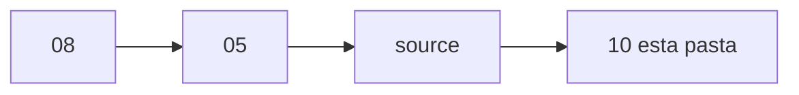

# Processos implementados — recapitulacao do que foi feito

Esta pasta guarda o **depois**: o que o jogo era, o que mudou, e o que voce
implementou. Nao e spec (isso vive em `05-Specs/` **antes** de codar). Nao e
o diario (isso e o rascunho do dia). Aqui e o texto que voce relê daqui a
semanas e ainda entende.

Use quando uma mudanca no jogo ja foi testada e voce quer lembrar o
raciocinio — especialmente as de UI, encoding, clique, layout.

---

## Quando criar uma nota aqui

Depois de um bloco de trabalho que **o jogador percebe** (janela nova,
comportamento diferente, bug visivel corrigido) **ou** que ensinou um
conceito que voce vai reencontrar (ImGui, UTF-8 vs ANSI, captura de mouse).

Nao precisa para: typo, um comentario, um ajuste de uma linha.

## Como preencher

1. Copie `TEMPLATE-Processo.md` para `AAAA-MM-DD - nome-curto.md`.
2. Preencha **Como era** com honestidade (mesmo que tenha ficado feio).
3. Em **O que implementei**, explique o "por que" em linguagem simples.
4. Liste arquivos reais do repo do jogo (`SrcGame/...`), nao so "a janela".
5. Coloque uma linha no `CHANGELOG.md` (topico certo: Quest, HUD, etc.).
6. Se couber, uma entrada curta no diario (`04-Diario-do-Projeto/`).



## Relacao com o resto do vault

```
ideia     -> 08-Ideias/
planejar  -> 05-Specs/          (antes de implementar)
mapa de UI -> 12-UI-e-Artes/
fazer     -> codigo no Windows
anotar o dia -> 04-Diario-do-Projeto/
resumo 30s   -> CHANGELOG.md
recap completa -> 10-Processos/   (esta pasta)
```

---

## Indice

Bloco maior (varias telas + SQL + Server.exe): pasta
[[11-Evolucao/index|11-Evolucao]].

Mapa de artes e roadmap (nao substitui os recaps abaixo):
`12-UI-e-Artes/index`.

| Data | Processo | Modulo | Status |
|---|---|---|---|
| 2026-09-06 | [[2026-09-06 - Recap Desafios ImGui]] | cliente / Quest | feito |
| 2026-09-08 | [[2026-09-08 - Recap janelas ImGui de jogador]] | cliente / HUD | feito |
| 2026-09-08 | [[2026-09-08 - Recap loja SQL e painel Server]] | servidor / loja | feito |
| 2026-09-13 | [[2026-09-13 - Recap artes de login e titulos ImGui]] | cliente / artes | parcial |
| 2026-09-15 | [[2026-09-15 - Recap Armazem ImGui paginas e busca]] | cliente / servidor / shared | feito |
| 2026-09-15 | [[2026-09-15 - Recap Distribuidor ImGui e correio 168h]] | cliente / servidor / shared | feito |
| 2026-09-16 | [[2026-09-16 - Recap painel Server.exe splash e Segoe]] | servidor / ferramenta | feito |
| 2026-09-16 | [[2026-09-16 - Recap painel Server.exe modal e operador]] | servidor / ferramenta | feito |
| 2026-09-17 | [[2026-09-17 - Recap Armazem SQL 300 slots]] | cliente / servidor / shared / SQL | codigo (SSMS pendente; save vivo revertido 18/09) |
| 2026-09-18 | [[2026-09-18 - Recap Armazem arquivo WH03]] | cliente / servidor / shared | feito |
| 2026-09-19 | [[2026-09-19 - Recap Mestre dos Clan ImGui]] | cliente / servidor / shared / SQL | parcial (codigo) |
