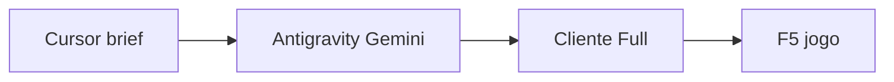

# Como gerar artes visuais

PNG, TGA e pecas de UI **nao** nascem no Cursor. O ganho de tela nova e:

- **ImDrawList** (codigo): moldura ImGui, X, split, abas — regra 15
- **Antigravity (Gemini):** so arquivos que o C++ carrega

Quando o Cursor **criar ou refatorar uma janela**, ele deve entregar um
**prompt completo** (copiar/colar), com referencias concretas — bronze
do login, botoes com texto centralizado da selecao, titulo 400x64.
Regra: `.cursor/rules/06-antigravity-brief.mdc`.
Template: `Source-Priston/docs/prompt-antigravity-TEMPLATE.md`.

Fluxo:

1. Cursor escreve o brief (nomes, tamanho, estilo, o que nao redesenhar).
2. Voce cola no **Antigravity**, modelo **Gemini**.
3. Salvar no **Cliente Full**, no path que o C++ ja carrega.
4. (Opcional) copiar para `C:\Source Priston\Source Priston\game\images`
   se quiser versionar ou o Cursor ver a imagem.
5. Testar no jogo (F5 aponta para o Cliente Full).
6. Atualizar [[Inventario-de-Artes]] e uma linha no CHANGELOG se a tela
   mudou de verdade.

Caminhos: [[Tres-Diretorios]]. Runtime: [[Onde-vivem-as-imagens]].
Cromado ImGui / titulo 400x64: `.cursor/rules/15-imgui-windows.mdc`.

## O que o prompt precisa citar (exemplos)

- "Textura de bronze envelhecido igual `window.png` / `btl.png` do login
  (`C:\Cliente Full\game\images\login\`)."
- "Botoes com texto centralizado, 128x32, igual `Bt_select.tga` da
  selecao (`StartImage\login\CharSelect\`)."
- "Titulo 400x64, icone + nome na placa, igual `desafios.png`."
- HUD de pedra: familia `shop-1.bmp`, **nao** o cromado ImGui (ADR 0005).

Orientacao vaga ("mais bonito", "medieval") nao serve.

## Briefs ja existentes (repo da source)

| Tela | Brief |
|---|---|
| Template vazio | `docs/prompt-antigravity-TEMPLATE.md` |
| Selecao / criacao de personagem | `docs/prompt-antigravity-charselect-ui.md` |
| Armazem (titulo ImGui 400x64) | `docs/prompt-antigravity-armazem-ui.md` |
| Login de conta | ja feito a parte (`game\images\login\`); nao redesenhar no brief de char select |

## Regras que o Gemini precisa respeitar (resumo)

- Mesmo **nome de arquivo** que o codigo procura. Path novo = tela preta
  ou fallback de texto.
- Titulo de janela ImGui: **400x64**, desenho recortado (sem canvas enorme
  vazio).
- Char select: TGA 32-bit com alpha, dimensoes da tabela do prompt.
- Estilo: pedra escura + bronze/ouro antigo; sem neon, vidro, sci-fi.
- Destino de gravacao: **`C:\Cliente Full\...`**, nao a source.

## O que o Cursor faz depois da arte existir

- Apontar o path no C++ **so se ainda nao existir** (na duvida, o path
  ja esta no codigo).
- Nao inventar `game\images\ui\` paralelo (9-slice foi revertido).
- Nao gerar PNG por conta propria neste projeto.

Hub: [[index]].
