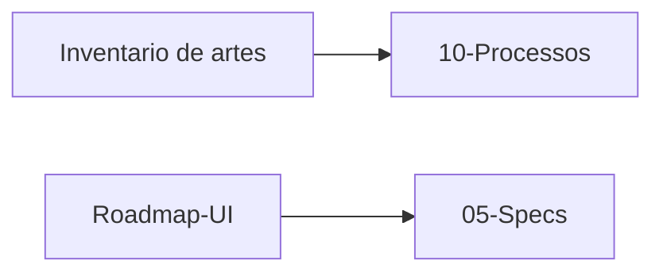

# UI e artes — o lugar para revisar o que ja foi e o que resta

Abra esta pasta quando quiser lembrar **o que o jogador ja ve**, **onde
as imagens realmente vivem**, e **o que ainda e ideia**. Nao e spec (isso
mora em `05-Specs/` antes de codar). Nao e o recap de uma tela so
(`10-Processos/`). Aqui e o mapa.

Regra pratica: se a pergunta e "ja fizemos isso na UI?" — comeca aqui.
Se a pergunta e "como vou implementar?" — vai para a spec linkada.

## Como usar

```
feito no jogo     -> Inventario-de-Artes.md  +  10-Processos/
onde copiar PNG   -> Onde-vivem-as-imagens.md
como gerar PNG    -> Como-gerar-artes.md  (Antigravity + Gemini)
prompt da tela    -> regra Cursor 06 + docs/prompt-antigravity-*.md
cromado ImGui     -> ImDrawList / 15-imgui-windows.mdc (nao e PNG)
o que vem depois  -> Roadmap-UI.md  +  05-Specs/
por que ImGui vs pedra -> ADR 0005 (e ADR 0002)
cromado de jogador     -> regra Cursor 15-imgui-windows.mdc
tres diretorios        -> Tres-Diretorios.md  +  regra 05
```

Contrato visual do jogador (janela ImGui): no repo do jogo,
`.cursor/rules/15-imgui-windows.mdc`. Layout de referencia:
`QuestWindow.cpp`. Cromado polido: `Settings.cpp`.

Cliente que o `game.exe` le: `C:\Cliente Full`.
Source (codigo + copia opcional de PNG): `C:\Source Priston\Source Priston`.

## Estado em 30 segundos (2026-09-19)

| Frente | Status |
|---|---|
| Titulos ImGui kit B + `frame.png` 760×540 | feito nas janelas grandes (inclui mix/quest/shop/ranking/settings/clan) |
| Login de conta (PNG Fallen Tale) | feito no cliente; source e cliente podem divergir |
| Intro splash | codigo; arte `intro.png` opcional |
| Selecao / criacao de personagem | arte em brief; jogo ainda TGA classico |
| Distribuidor (lista + correio 168h) | **feito** 2026-09-15 — planta [[Distribuidor]] |
| Armazem (paginas + busca + ImGui + WH03) | UI 15/09; SQL tentado 17/09; save vivo **arquivo** 18/09 — [[Armazem]], ADR 0009 |
| Mestre dos Clan | codigo 19/09 — [[Clan]], teste pendente |
| Botao organizar inventario | spec rascunho — nao implementado |



## Indice desta pasta

- [[Onde-vivem-as-imagens]] — Cliente Full vs pasta `game/images` na source
- [[Como-gerar-artes]] — Antigravity + Gemini, gravar no Cliente Full
- [[Inventario-de-Artes]] — o que ja existe, o que falta, o que e classico de proposito
- [[Roadmap-UI]] — ordem sugerida e o que toca `Shared/`

## Specs

- [[2026-09-13-distribuidor-correio]] — **feita** (codigo 2026-09-15)
- [[2026-09-13-armazem-paginas-busca]] — **feita** (codigo 2026-09-15)
- [[2026-09-13-inventario-organizar]] — ainda nao e codigo

## Decisoes e recaps

- [[0002 - Duas identidades visuais jogador vs ferramenta]]
- [[0005 - Distribuidor ImGui, armazem e inventario em pedra, artes no Cliente Full]]
- [[0006 - Armazem ImGui, paginas no mesmo transcode]]
- [[0008 - Armazem SQL, 300 slots, 5 paginas 3 liberadas]]
- [[2026-09-06 - Recap Desafios ImGui]]
- [[2026-09-08 - Recap janelas ImGui de jogador]]
- [[2026-09-13 - Recap artes de login e titulos ImGui]]
- [[2026-09-15 - Recap Armazem ImGui paginas e busca]]
- [[2026-09-15 - Recap Distribuidor ImGui e correio 168h]]
- Bloco HUD 2026-09-08: [[2026-09-08 - HUD ImGui lojas ranking mix e painel do servidor]]
- Bloco armazem SQL 2026-09-17: [[2026-09-17 - Armazem SQL e capacidade]]
- Bloco distribuidor + painel 2026-09-16: [[2026-09-16 - Distribuidor ImGui, correio e painel Server]]
- [[2026-09-16 - Recap painel Server.exe splash e Segoe]]
- [[2026-09-16 - Recap painel Server.exe modal e operador]]

## Relacao com o resto do vault

```
ideia          -> 08-Ideias/
planejar       -> 05-Specs/
mapa de UI     -> 12-UI-e-Artes/   (esta pasta)
fazer          -> codigo no Windows (Source-Priston) + PNG no Cliente Full
anotar o dia   -> 04-Diario-do-Projeto/
resumo 30s     -> CHANGELOG.md
recap de tela  -> 10-Processos/
decisao "por que" -> 06-Decisoes/
bloco inteiro  -> 11-Evolucao/
```
