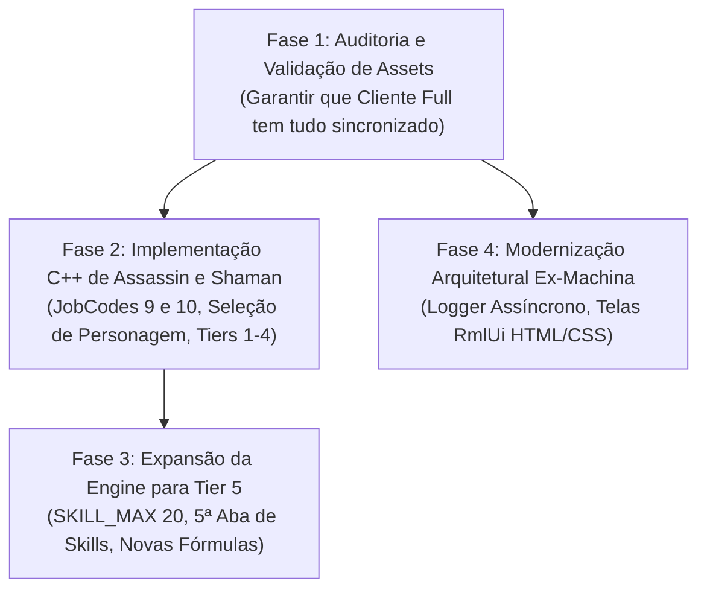

---
tags: [planejamento, roteiro, integracao, fallen, assassin, shaman, tier5]
---

# 05 - Roteiro de Integração para o Projeto Fallen

Plano de ação estratégico para trazer o melhor desta análise para o nosso projeto **Fallen**, de forma modular, segura e sem quebrar o servidor ativo.

---

## 🎯 Visão Geral da Estratégia

Como nossa auditoria comprovou que:
1. Os **assets visuais e sonoros** (modelos 3D, animações, ícones, sons, partículas) já existem no cliente.
2. O que falta é a **implementação da lógica no C++**.
3. A source Ex-Machina oferece **inovações arquiteturais excelentes** (Logger, RmlUi, Zero `__asm`).

A abordagem recomendada é dividir o trabalho em **4 Fases Independentes**:



---

## 📋 Fase 1: Auditoria e Validação de Assets no `Cliente Full`

**Meta:** Garantir que o cliente de jogo que os jogadores usam (`C:\Cliente Full`) tenha 100% dos arquivos necessários para renderizar tudo sem crash.

1. **Checar Pastas de Personagens:**
   - Confirmar se `C:\Cliente Full\char\tmABCD\` possui todos os arquivos `CtfbD*.smd` (Assassin) e `CmmbD*.smd` (Shaman).
   - Confirmar as animações `tfh-D01..04.inx` e `Mmh-D01..04.inx`.
2. **Checar Sons de Habilidades e Personagem:**
   - Confirmar `wav\Effects\Player\Assassin\` e `wav\Effects\Player\Shaman\`.
3. **Checar Partículas:**
   - Comparar `D:\Cliente e Server Arquivos\client\Effect\Particle\Script\` com `C:\Cliente Full\Effect\Particle\Script\`.
   - Copiar quaisquer arquivos `.part` de Tier 5 ou classes novas que porventura estejam faltando no Cliente Full.
4. **Registrar no `AssaLoadingFile.txt`:**
   - Garantir que todas as partículas de efeitos estejam declaradas para pré-carregamento no boot do cliente.

---

## 📋 Fase 2: Implementação C++ de Assassin e Shaman

**Meta:** Permitir que novos personagens das classes 9 e 10 sejam criados, loguem no jogo, ataquem, usem armaduras e subam de nível.

### 2.1. Arquivos a Modificar no `Shared`
- `smPacket.h`:
  ```cpp
  #define JOBCODE_ASSASSIN    9
  #define JOBCODE_SHAMAN      10
  ```

### 2.2. Arquivos a Modificar no `SrcGame` (Cliente)
- `cSelect`:
  - Adicionar botão da Assassin na tribo Tempskron.
  - Adicionar botão do Shaman na tribo Morayion.
  - Carregar modelo 3D padrão na tela de seleção.
- `playmodel.h` e `character.cpp`:
  - Mapear a tabela de troca de armaduras e armas para os índices 9 e 10.
- `sinInvenTory.cpp`:
  - Restrições de uso de itens por classe (Daggers e Claws para Assassin; Phantoms e Scythes para Shaman).
- `sinSkill_Info.cpp` e `sinSkill.h`:
  - Registrar os IDs e tabelas de atributos dos Tiers 1 a 4 para ambas as classes.

### 2.3. Arquivos a Modificar no `SrcServer` (Servidor)
- `OnSever.cpp` e `character.cpp`:
  - Reconhecer `JOBCODE_ASSASSIN` e `JOBCODE_SHAMAN` no carregamento e salvamento de personagem.
  - Inicialização de atributos padrão de novo personagem (Força, Inteligência, etc.).
- `Svr_Damge.cpp`:
  - Tratar as habilidades e ataques físicos/mágicos das novas classes.

---

## 📋 Fase 3: Expansão da Engine para a Tier 5

**Meta:** Permitir o 5º avanço de classe e a liberação das 4 novas habilidades para todas as classes do servidor.

### 3.1. Estruturas de Dados (`Shared\smPacket.h`)
- Expandir o limite de colunas de habilidades:
  ```cpp
  #define SKILL_POINT_COLUM_MAX   20  // Expandido de 16 para 20
  ```
- Atualizar as estruturas de envio de habilidades (`TRANS_RECORD_DATA`, buffers de rede).

### 3.2. Interface do Usuário (`SrcGame\src\Game\sinbaram\sinSkill.cpp`)
- Configurar o botão da 5ª aba no menu de habilidades.
- Usar a textura `Gage-5.dds` quando o personagem for Rank 5.
- Renderizar as 4 habilidades de T5 de acordo com a classe do jogador.

### 3.3. Quest e NPC de Avanço (`SrcServer`)
- Configurar o diálogo com o mestre de habilidades no Level 100+ para promover o jogador ao Rank 5.
- Atualizar a tabela de títulos (`image\Sinimage\skill\<Classe>\JobTitle\5.dds`).

### 3.4. Lógica de Dano e Buffs
- Implementar as fórmulas matemáticas das novas habilidades (ex: aumento de crítico, absorção de dano, buffs em grupo, debuffs de status) em `Damage.cpp` e `Svr_Damge.cpp`.

---

## 📋 Fase 4: Adoção dos Tesouros do Ex-Machina

**Meta:** Modernizar a estabilidade e capacidade de interface do Fallen.

1. **Adotar o Logger Assíncrono (`Logger.cpp` + `AsyncWorker.cpp`):**
   - Portar essas duas classes para o `SrcServer` do Fallen.
   - Redirecionar os logs de segurança e GM (como nosso `Create-GMLog.sql`) e logs de drop para a fila assíncrona, eliminando qualquer micro-travamento do servidor.
2. **Integração do RmlUi para Novas Janelas:**
   - Estudar a biblioteca RmlUi para criar telas futuras modernas (ex: Loja Virtual, Painel de Ranking, Passe de Batalha) em HTML/CSS sem ter que programar cada botão na unha com DirectX antigo.
3. **Limpeza de `__asm`:**
   - Substituir os 8 blocos de `__asm` restantes no Fallen pelas funções C++ portáveis testadas no Ex-Machina.

---

## ⚠️ Cuidados e Prevenções

- **Compatibilidade de Saves:** A mudança de `SKILL_POINT_COLUM_MAX` de 16 para 20 altera o tamanho do pacote do jogador. Deve ser feita com migração planejada de banco e compilação sincronizada de `Game.exe` e `Server.exe`.
- **Procedimento Seguro:** Antes de alterar qualquer linha de C++, manteremos o compromisso de planejar os diffs no `implementation_plan.md` e testar localmente em compilações de Debug.