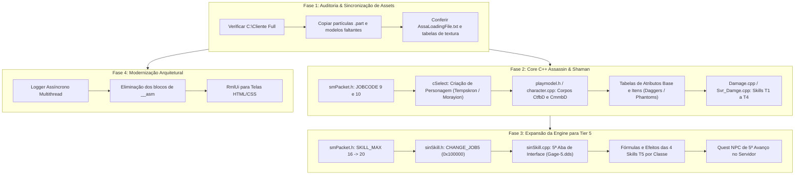

# Plano Mestre de Integração: Assassin, Shaman, Tier 5 e Modernização da Engine Fallen

Plano de ação detalhado para conduzir a integração segura e modular dos novos conteúdos e melhorias arquiteturais identificados na análise da base Ex-Machina para o projeto **Fallen Priston Tale**, alinhando Cliente, Servidor e Banco de Dados.

---

## User Review Required

> [!IMPORTANT]
> **Compatibilidade de Pacotes e Saves de Jogadores:**
> A expansão para a **Tier 5** exige aumentar `SKILL_POINT_COLUM_MAX` de 16 para 20. Isso altera o tamanho das estruturas `smCHAR_INFO`, `TRANS_RECORD_DATA` e dos buffers de gravação de personagem.
> Portanto, o Cliente (`Game.exe`) e o Servidor (`Server.exe`) devem ser compilados rigorosamente juntos com a mesma versão das estruturas para evitar descompasso de rede.

> [!WARNING]
> **Banco de Dados e Persistência:**
> As contas existentes gravam seus registros no banco de dados e arquivos de save. A adição dos novos códigos de classe (Assassin = 9, Shaman = 10) e da 5ª aba de skills requer validação de schemas SQL (tabelas de personagens e colunas de classe) para assegurar que personagens de classes 9 e 10 sejam aceitos sem truncamento ou violação de constraints.

---

## Estratégia de Execução em 4 Fases

Para garantir estabilidade máxima e zero risco de regressão, o trabalho será dividido em 4 fases sequenciais:



---

## Detalhamento das Alterações Propostas

### Fase 1: Auditoria e Sincronização de Assets (`C:\Cliente Full`)

- **Objetivo:** Garantir que o diretório de execução real do jogo (`C:\Cliente Full`) contenha todos os arquivos sem risco de tela preta, efeito invisível ou crash por falta de arquivo `.smd` ou `.part`.
- **Ações:**
  - Comparar `D:\Cliente e Server Arquivos\client\` com `C:\Cliente Full\`.
  - Sincronizar scripts `.part` de Tier 5 e classes novas em `Effect\Particle\Script\`.
  - Validar arquivos de modelos 3D em `char\tmABCD\` (`CtfbD*.smd`, `CmmbD*.smd`, `tfh-D01..04.inx`, `Mmh-D01..04.inx`).
  - Validar áudios em `wav\Effects\Player\Assassin` e `Shaman`.
  - Atualizar `AssaLoadingFile.txt` para incluir o pré-carregamento dos novos efeitos.

---

### Fase 2: Implementação C++ das Classes Assassin e Shaman

#### [MODIFY] [Shared/smPacket.h](file:///c:/Source%20Priston/Source%20Priston/Shared/smPacket.h)
- Adicionar definições dos novos códigos de classe:
  ```cpp
  #define JOBCODE_ASSASSIN   9
  #define JOBCODE_SHAMAN     10
  ```
- Atualizar verificações de intervalo de classes válidas (de `1..8` para `1..10`).

#### [MODIFY] [SrcGame/src/Game/cSelect.cpp](file:///c:/Source%20Priston/Source%20Priston/SrcGame/src/Game/cSelect.cpp) (ou equivalente)
- Adicionar os botões de seleção de personagem:
  - 5º botão na tribo Tempskron: Assassin.
  - 5º botão na tribo Morayion: Shaman.
- Carregar os modelos 3D base de preview na seleção (`tfh-D01.inx` e `Mmh-D01.inx`).

#### [MODIFY] [SrcGame/src/Game/character.cpp](file:///c:/Source%20Priston/Source%20Priston/SrcGame/src/Game/character.cpp) e [SrcServer/src/Server/Character/character.cpp](file:///c:/Source%20Priston/Source%20Priston/SrcServer/src/Server/Character/character.cpp)
- Mapear tabelas de armaduras e roupas para as novas classes (`CtfbD` e `CmmbD`).
- Configurar atributos iniciais e ganhos por level up de Assassin (Agilidade/Talento) e Shaman (Inteligência/Talento).

#### [MODIFY] [SrcGame/src/Game/sinbaram/sinSkill.h](file:///c:/Source%20Priston/Source%20Priston/SrcGame/src/Game/sinbaram/sinSkill.h) e [sinSkill_Info.cpp](file:///c:/Source%20Priston/Source%20Priston/SrcGame/src/Game/sinbaram/sinSkill_Info.cpp)
- Definir `GROUP_ASSASSIN (0x0A000000)` e `GROUP_SHAMAN (0x0B000000)`.
- Registrar as 16 habilidades iniciais (Tiers 1 a 4) de ambas as classes.
- Implementar as rotinas de cálculo de dano e efeitos em `Damage.cpp` e `Svr_Damge.cpp`.

---

### Fase 3: Expansão da Engine para Tier 5 (5º Avanço)

#### [MODIFY] [Shared/smPacket.h](file:///c:/Source%20Priston/Source%20Priston/Shared/smPacket.h)
- Expandir o limite máximo de colunas de skills:
  ```cpp
  #define SKILL_POINT_COLUM_MAX   20  // Expandido de 16 para 20
  ```

#### [MODIFY] [SrcGame/src/Game/sinbaram/sinSkill.h](file:///c:/Source%20Priston/Source%20Priston/SrcGame/src/Game/sinbaram/sinSkill.h)
- Adicionar modificador de Tier 5:
  ```cpp
  #define CHANGE_JOB5             0x00100000
  ```
- Definir os IDs hexadecimais das 4 skills T5 para cada classe.

#### [MODIFY] [SrcGame/src/Game/sinbaram/sinSkill.cpp](file:///c:/Source%20Priston/Source%20Priston/SrcGame/src/Game/sinbaram/sinSkill.cpp)
- Atualizar a interface gráfica de skills para desenhar a 5ª aba de habilidades.
- Configurar o carregamento de `Gage-5.dds` para personagens que completarem a quest de Tier 5.

#### [MODIFY] [SrcServer/src/Server/Character/Damage.cpp](file:///c:/Source%20Priston/Source%20Priston/SrcServer/src/Server/Character/Damage.cpp) e [Svr_Damge.cpp](file:///c:/Source%20Priston/Source%20Priston/SrcServer/src/Server/Server/Svr_Damge.cpp)
- Implementar as rotinas de dano, buffs e efeitos especiais das novas habilidades de Tier 5.

#### [NEW] [docs/sql/Migrate-Tier5-And-Jobs.sql](file:///c:/Source%20Priston/Source%20Priston/docs/sql/Migrate-Tier5-And-Jobs.sql)
- Script de conferência e migração de banco de dados para garantir que as tabelas de personagens aceitem classes 9 e 10 e colunas/buffers de 20 skills.

---

### Fase 4: Modernização Arquitetural Ex-Machina

#### [NEW] `Shared/IO/AsyncLogger.h` e `AsyncLogger.cpp`
- Portar o Logger multithread assíncrono do Ex-Machina para o Fallen, desacoplando a escrita em disco dos loops de jogo.

#### [MODIFY] Substituição dos 8 trechos de `__asm` restantes
- Migrar para intrínsecos e C++ padrão portável, deixando o Fallen pronto para futura compilação em x64 nativo.

---

## Plano de Verificação e Testes

### 1. Compilações Automatizadas
- A cada modificação de código, executar compilação completa via MSBuild:
  - Servidor: `MSBuild.exe SrcServer\server.sln /p:Configuration=Release /p:Platform=Win32 /m`
  - Cliente: `MSBuild.exe SrcGame\Game.sln /p:Configuration=Release /p:Platform=Win32 /m`
  - Critério: **Zero erros de compilação**.

### 2. Validação de Assets
- Script em PowerShell para testar se cada arquivo referenciado pelos novos códigos (`.smd`, `.inx`, `.part`, `.dds`, `.wav`) existe no disco do `Cliente Full`.

### 3. Teste em Jogo Local
- Criar personagem Assassin e entrar no jogo.
- Criar personagem Shaman e entrar no jogo.
- Testar visualização do modelo 3D, corrida, ataque básico e animações.
- Testar subida de nível e distribuição de pontos de atributos.
- Testar uso de habilidades de Tier 1.
- Testar expansão da interface de Tier 5 com 5 abas ativas.
